# Farmer-to-Consumer Platform - Class Diagram

## Mermaid Class Diagram

```mermaid
classDiagram
    class User {
        -ObjectId user_id
        -String user_type
        -String email
        -String phone
        -String password_hash
        -String name
        -String profile_pic
        -Boolean is_active
        -Boolean is_verified
        -String verification_token
        -Date created_at
        -Date updated_at
        +registerUser()
        +loginUser()
        +updateProfile()
        +verifyEmail()
    }

    class Farmer {
        -ObjectId farmer_id
        -ObjectId user_id
        -String farm_name
        -Number farm_size
        -Object location
        -Object address
        -Number avg_rating
        -Number total_orders
        -Number total_revenue
        -Object bank_account
        -Object documents
        -Array delivery_zones
        +createProduct()
        +updateProduct()
        +viewOrders()
        +processPayment()
        +acceptOrder()
    }

    class Consumer {
        -ObjectId consumer_id
        -ObjectId user_id
        -Array addresses
        -Array saved_farmers
        -Array favorite_products
        -Number total_orders
        -Number total_spent
        -Number avg_rating_given
        -Object preferences
        -Object cart
        +addToCart()
        +placeOrder()
        +makePayment()
        +rateProduct()
        +saveFarmer()
    }

    class DeliveryPartner {
        -ObjectId partner_id
        -ObjectId user_id
        -String vehicle_type
        -String vehicle_number
        -String vehicle_color
        -String license_number
        -Date license_expiry
        -Object location
        -String availability_status
        -Number rating
        -Number total_deliveries
        -Number successful_deliveries
        -Object earnings
        +acceptDelivery()
        +updateLocation()
        +completeDelivery()
        +viewEarnings()
        +rateFarmer()
    }

    class Product {
        -ObjectId product_id
        -ObjectId farmer_id
        -String name
        -String description
        -String category
        -String subcategory
        -Number price
        -String unit
        -Number weight
        -String quality
        -Boolean is_available
        -Number stock_quantity
        -Number total_sold
        -Number avg_rating
        +updatePrice()
        +updateStock()
        +addReview()
    }

    class Order {
        -ObjectId order_id
        -String order_number
        -ObjectId consumer_id
        -ObjectId farmer_id
        -ObjectId delivery_partner_id
        -Array items
        -Number subtotal
        -Number tax
        -Number delivery_charge
        -Number total_price
        -String payment_method
        -String payment_status
        -String status
        -Object pickup_location
        -Object delivery_address
        -Date created_at
        -Date delivered_at
        +createOrder()
        +updateStatus()
        +cancelOrder()
        +assignDelivery()
    }

    class Payment {
        -ObjectId payment_id
        -ObjectId order_id
        -ObjectId consumer_id
        -Number amount
        -String currency
        -String payment_method
        -String payment_gateway
        -String transaction_id
        -Object gateway_response
        -Object card_details
        -String status
        -Date created_at
        +processPayment()
        +refundPayment()
        +verifyTransaction()
    }

    class Review {
        -ObjectId review_id
        -ObjectId order_id
        -ObjectId reviewer_id
        -String reviewer_type
        -String reviewee_type
        -ObjectId reviewee_id
        -Number rating
        -String title
        -String comment
        -Boolean verified_purchase
        -Number helpful_count
        -Date created_at
        +submitReview()
        +updateRating()
    }

    class Admin {
        -ObjectId admin_id
        -ObjectId user_id
        -String role
        -Array permissions
        -Date created_at
        +manageUsers()
        +viewAnalytics()
        +handleDisputes()
        +approveDocuments()
    }

    %% Relationships
    User <|-- Farmer : extends
    User <|-- Consumer : extends
    User <|-- DeliveryPartner : extends
    User <|-- Admin : extends

    Farmer "1" -- "*" Product : creates
    Product "*" -- "1" Farmer : created_by

    Order "*" -- "1" Consumer : placed_by
    Order "*" -- "1" Farmer : fulfilled_by
    Order "*" -- "0..1" DeliveryPartner : delivered_by

    Order "*" -- "1" Payment : has

    Review "*" -- "1" Order : reviews
    Review "*" -- "1" Product : reviews
    Review "*" -- "1" Farmer : reviews
    Review "*" -- "1" DeliveryPartner : reviews

    Consumer "*" -- "*" Product : favorites
    Consumer "*" -- "*" Farmer : follows

    Order "*" -- "1" Product : contains

    Payment "*" -- "1" Consumer : belongs_to
```

## Diagram Description

### Core Entities

1. **User** - Base class for all user types with common authentication and profile information
2. **Farmer** - User specialization for farmers with farm details and product management
3. **Consumer** - User specialization for customers with cart and order history
4. **DeliveryPartner** - User specialization for delivery personnel with vehicle and location tracking
5. **Admin** - User specialization for platform administrators

### Transactional Entities

1. **Product** - Items for sale managed by farmers
2. **Order** - Purchase orders linking consumers, farmers, delivery partners, and payments
3. **Payment** - Transaction records for each order
4. **Review** - Ratings and feedback from users

### Key Relationships

- **User** is inherited by Farmer, Consumer, DeliveryPartner, and Admin
- **Farmer** creates and manages **Products**
- **Consumer** places **Orders**
- **Order** connects Consumer, Farmer, DeliveryPartner, and Payment
- **Review** captures feedback for Products, Farmers, and DeliveryPartners
- **Payment** processes transactions for Orders
