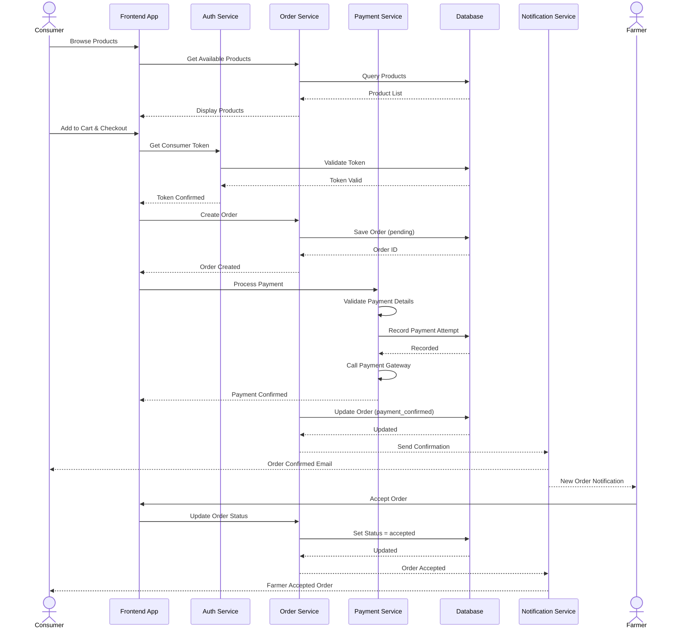
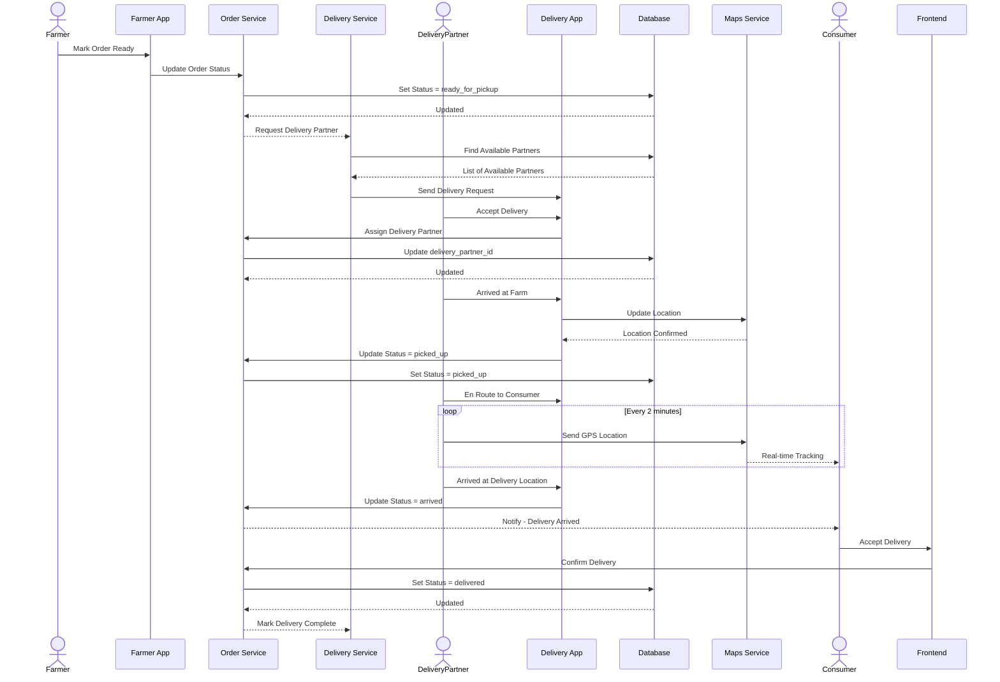
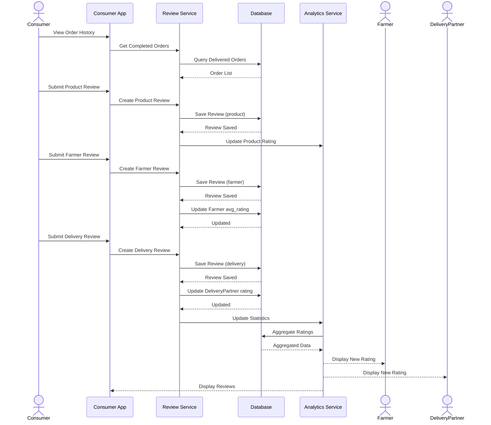
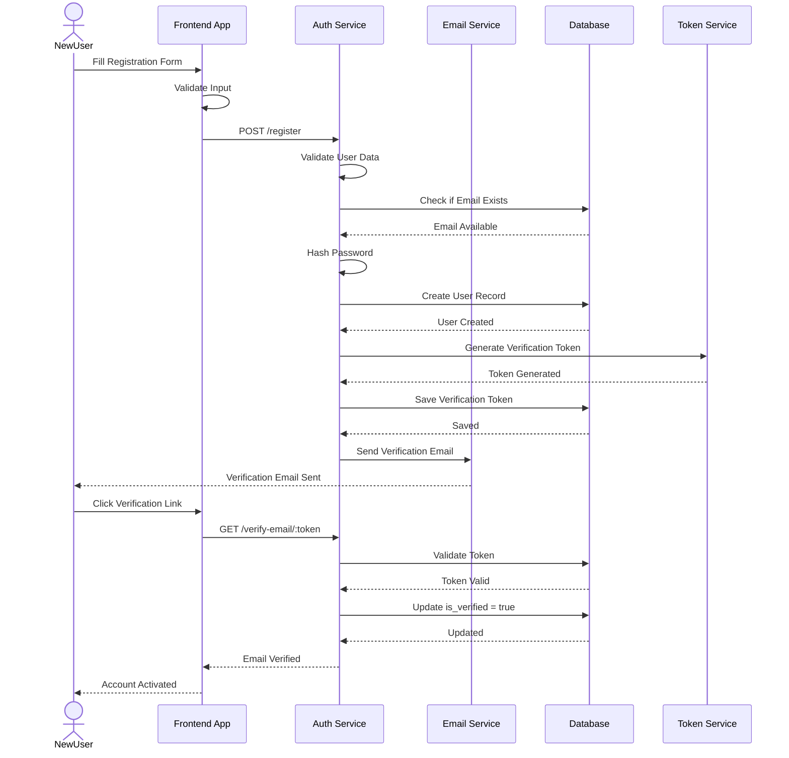
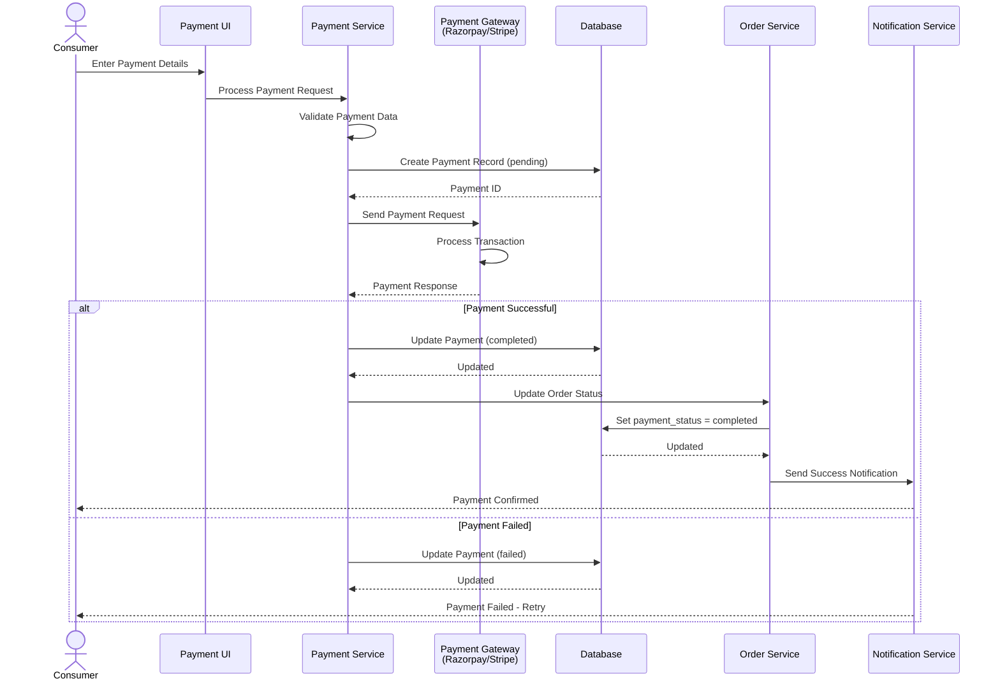
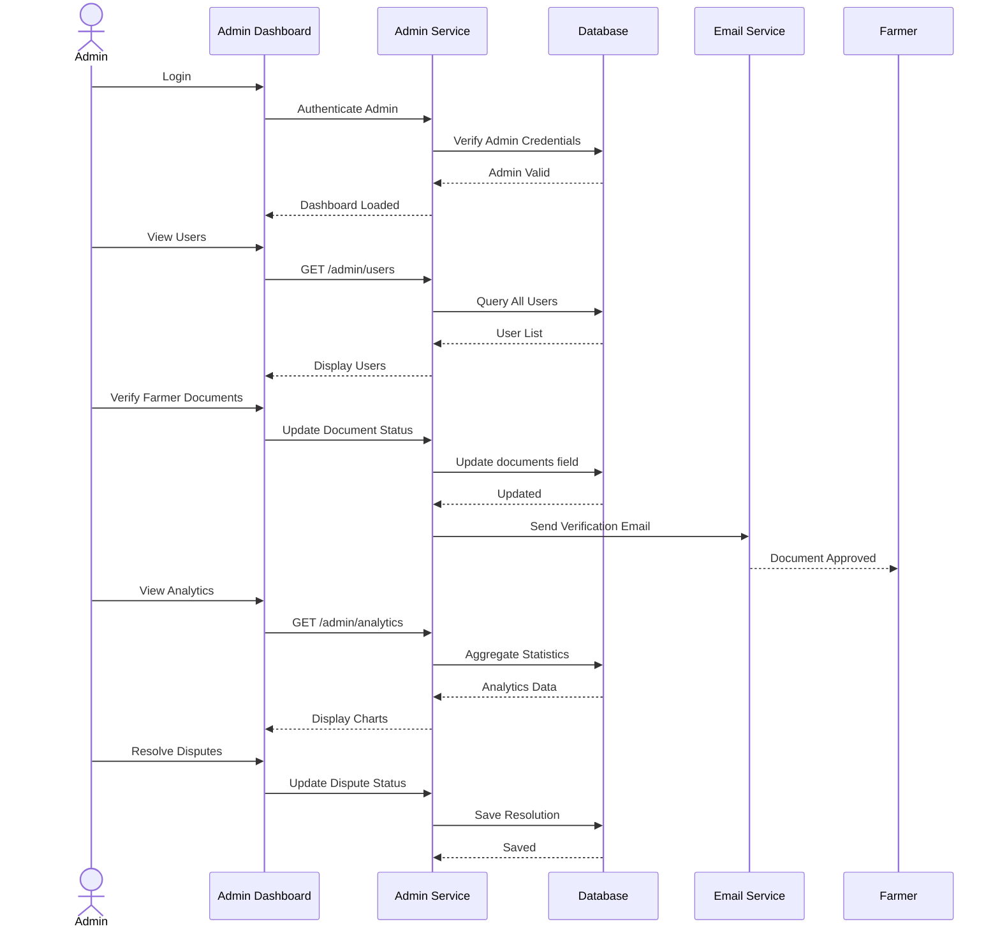

# Farmer-to-Consumer Platform - Sequence Diagrams

## 1. Order Placement and Payment Flow

## 2. Delivery Assignment and Tracking Flow

## 3. Review and Rating Flow

## 4. User Registration and Verification Flow

## 5. Payment Processing Flow

## 6. Admin Dashboard Operations Flow

