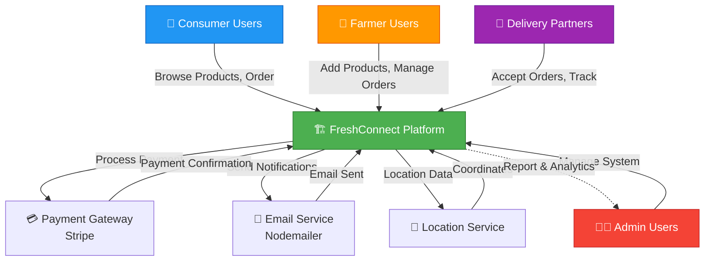
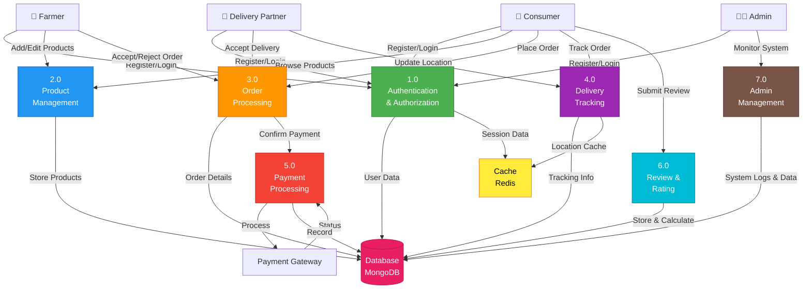
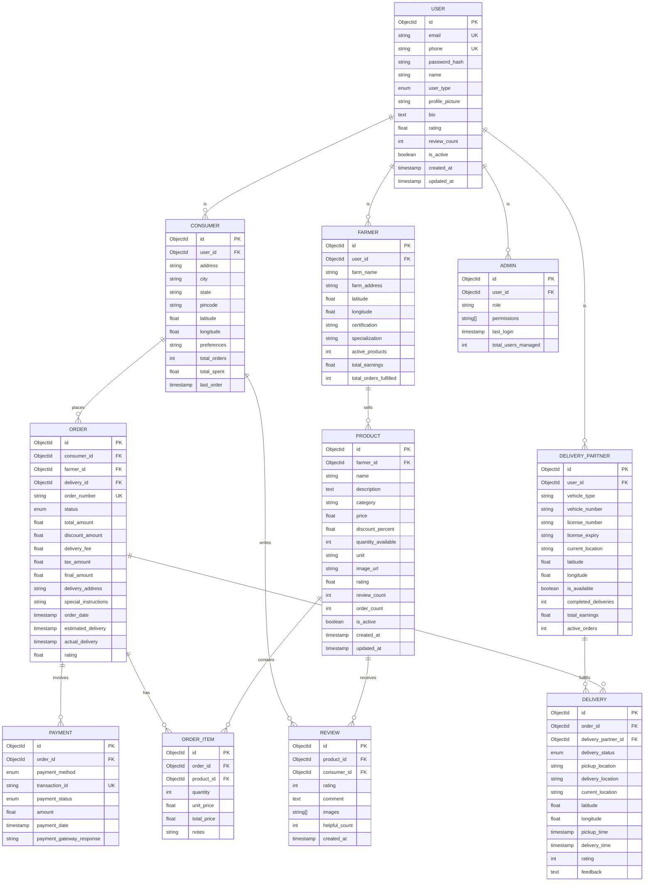
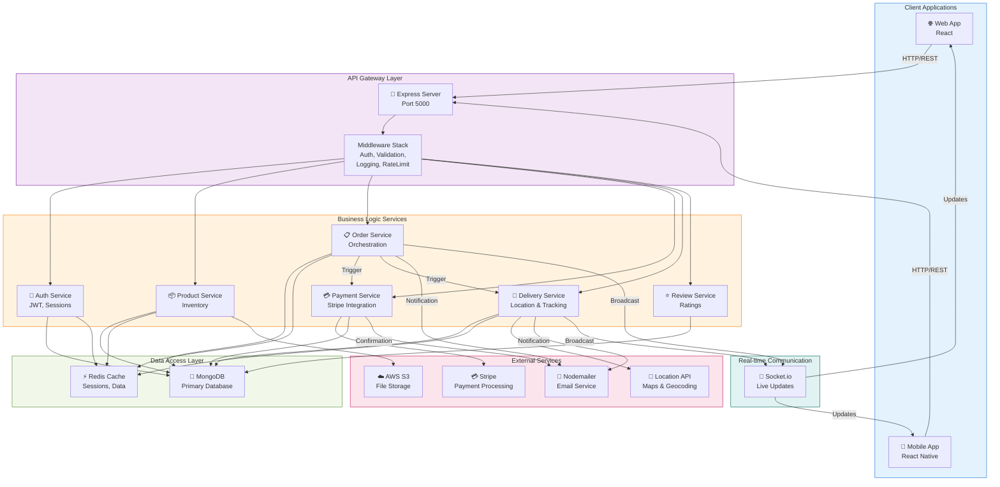
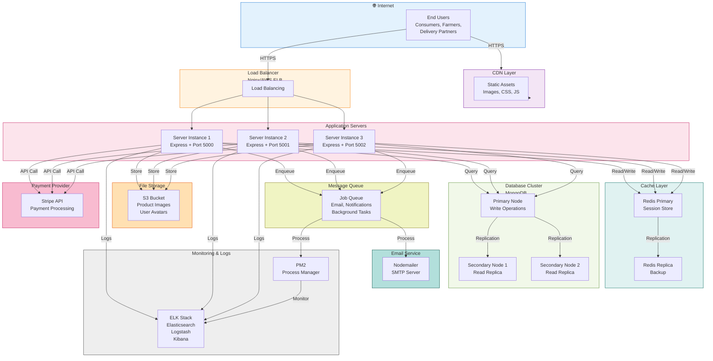
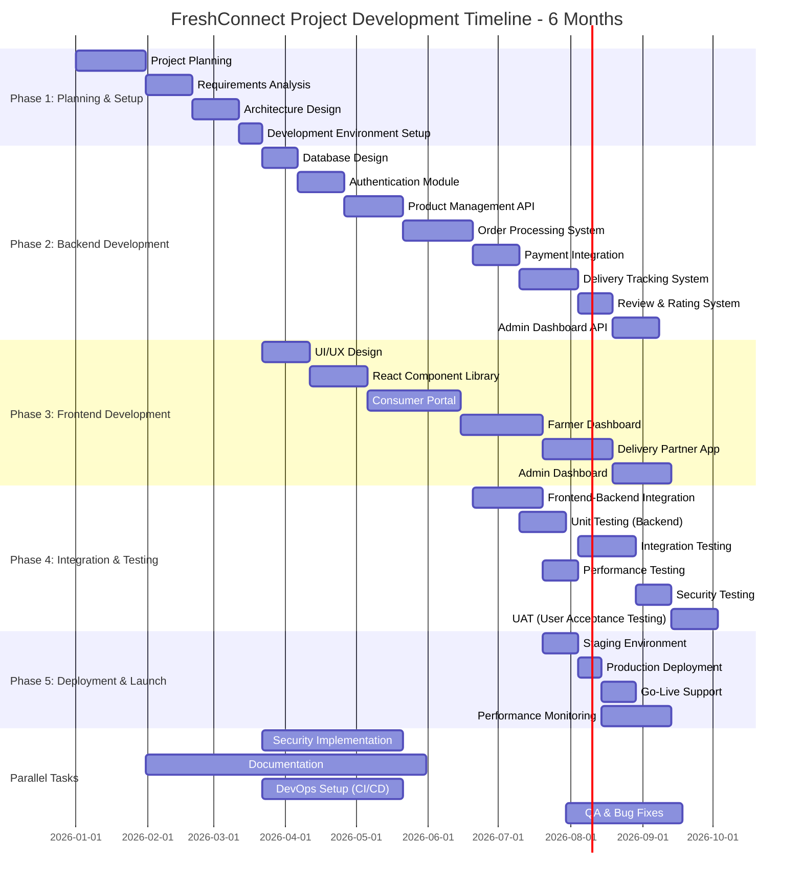

# 🏗️ FreshConnect System Diagrams

**Project**: FreshConnect - Agricultural E-Commerce Platform  
**Generated**: May 4, 2026  
**Architecture Documentation**: Complete System Design

---

## 📊 Table of Contents

1. [DFD Level 0 - System Context](#dfd-level-0)
2. [DFD Level 1 - Main Processes](#dfd-level-1)
3. [DFD Level 2 - Detailed Processes](#dfd-level-2)
4. [Use Case Diagram](#use-case-diagram)
5. [Entity-Relationship Diagram](#er-diagram)
6. [Sequence Diagram - Order Flow](#sequence-diagram)
7. [Collaboration Diagram](#collaboration-diagram)
8. [Network Diagram](#network-diagram)
9. [Gantt Chart](#gantt-chart)

---

## DFD Level 0

### System Context - Overall Data Flow



---

## DFD Level 1

### Main Processes



---

## DFD Level 2

### Detailed Process Flow - Order Processing (Process 3.0)

```mermaid
graph TB
    subgraph "3.1 Order Creation"
        direction TB
        Consumer["👥 Consumer"]
        Cart["Shopping Cart"]
        OrderForm["Order Form"]
        Validation["3.1.1 Validate Order"]
        
        Consumer -->|Browse| Cart
        Cart -->|Submit| OrderForm
        OrderForm -->|Order Data| Validation
    end
    
    subgraph "3.2 Order Assignment"
        direction TB
        FarmerMatch["3.2.1 Match Farmer"]
        FarmerNotif["3.2.2 Farmer Notification"]
        FarmerAccept["3.2.3 Farmer Accept/Reject"]
        
        Validation -->|Valid Order| FarmerMatch
        FarmerMatch -->|Send| FarmerNotif
        FarmerNotif -->|Farmer Response| FarmerAccept
    end
    
    subgraph "3.3 Payment Processing"
        direction TB
        PaymentInit["3.3.1 Payment Initiation"]
        PaymentGW["3.3.2 Gateway Processing"]
        PaymentStatus["3.3.3 Payment Confirmation"]
        
        FarmerAccept -->|Order Accepted| PaymentInit
        PaymentInit -->|Charge| PaymentGW
        PaymentGW -->|Response| PaymentStatus
    end
    
    subgraph "3.4 Delivery Assignment"
        direction TB
        DeliveryMatch["3.4.1 Match Delivery Partner"]
        DeliveryNotif["3.4.2 Delivery Notification"]
        DeliveryAccept["3.4.3 Accept Delivery"]
        
        PaymentStatus -->|Payment Done| DeliveryMatch
        DeliveryMatch -->|Send| DeliveryNotif
        DeliveryNotif -->|Partner Response| DeliveryAccept
    end
    
    subgraph "3.5 Order Fulfillment"
        direction TB
        Packing["3.5.1 Packing"]
        ReadyNotif["3.5.2 Ready Notification"]
        Pickup["3.5.3 Pickup"]
        Delivery["3.5.4 Delivery"]
        Complete["3.5.5 Order Complete"]
        
        DeliveryAccept -->|Start| Packing
        Packing -->|Send| ReadyNotif
        ReadyNotif -->|Partner Ready| Pickup
        Pickup -->|In Transit| Delivery
        Delivery -->|Delivered| Complete
    end
    
    Database[(Database)]
    
    Complete -->|Save Order Status| Database
    Validation -->|Save| Database
    PaymentStatus -->|Save| Database
    
    style Database fill:#E91E63,stroke:#AD1457,color:#fff
```



---

## Use Case Diagram

### System Use Cases for All Actors

```mermaid
graph TB
    Consumer["👥 Consumer"]
    Farmer["🌾 Farmer"]
    DeliveryPartner["🚗 Delivery Partner"]
    Admin["👨‍💼 Admin"]
    
    subgraph Core["FreshConnect Platform"]
        direction TB
        
        subgraph Auth["Authentication"]
            Register["Register Account"]
            Login["Login"]
            Logout["Logout"]
            ResetPassword["Reset Password"]
        end
        
        subgraph ConsumerUC["Consumer Use Cases"]
            Browse["Browse Products"]
            Search["Search Products"]
            ViewDetails["View Product Details"]
            AddCart["Add to Cart"]
            PlaceOrder["Place Order"]
            TrackOrder["Track Order"]
            ViewHistory["View Order History"]
            RateProduct["Rate & Review"]
            ManageProfile["Manage Profile"]
        end
        
        subgraph FarmerUC["Farmer Use Cases"]
            AddProduct["Add Product"]
            EditProduct["Edit Product"]
            ManageInventory["Manage Inventory"]
            ViewOrders["View Incoming Orders"]
            AcceptReject["Accept/Reject Order"]
            UpdateStatus["Update Order Status"]
            ViewEarnings["View Earnings"]
            ManageProfile2["Manage Profile"]
        end
        
        subgraph DeliveryUC["Delivery Partner Use Cases"]
            ViewDeliveries["View Available Deliveries"]
            AcceptDelivery["Accept Delivery"]
            UpdateLocation["Update Location"]
            TrackRoute["Track Route"]
            CompleteDelivery["Mark Delivery Complete"]
            ViewEarnings2["View Earnings"]
            ManageProfile3["Manage Profile"]
        end
        
        subgraph AdminUC["Admin Use Cases"]
            ViewAnalytics["View Analytics"]
            ManageUsers["Manage Users"]
            ViewReports["View Reports"]
            ConfigSystem["Configure System"]
            ManagePayments["Manage Payments"]
            ViewLogs["View System Logs"]
        end
    end
    
    Consumer -->|uses| Register
    Consumer -->|uses| Login
    Consumer -->|uses| Browse
    Consumer -->|uses| Search
    Consumer -->|uses| ViewDetails
    Consumer -->|uses| AddCart
    Consumer -->|uses| PlaceOrder
    Consumer -->|uses| TrackOrder
    Consumer -->|uses| ViewHistory
    Consumer -->|uses| RateProduct
    Consumer -->|uses| ManageProfile
    Consumer -->|uses| Logout
    
    Farmer -->|uses| Register
    Farmer -->|uses| Login
    Farmer -->|uses| AddProduct
    Farmer -->|uses| EditProduct
    Farmer -->|uses| ManageInventory
    Farmer -->|uses| ViewOrders
    Farmer -->|uses| AcceptReject
    Farmer -->|uses| UpdateStatus
    Farmer -->|uses| ViewEarnings
    Farmer -->|uses| ManageProfile2
    Farmer -->|uses| Logout
    
    DeliveryPartner -->|uses| Register
    DeliveryPartner -->|uses| Login
    DeliveryPartner -->|uses| ViewDeliveries
    DeliveryPartner -->|uses| AcceptDelivery
    DeliveryPartner -->|uses| UpdateLocation
    DeliveryPartner -->|uses| TrackRoute
    DeliveryPartner -->|uses| CompleteDelivery
    DeliveryPartner -->|uses| ViewEarnings2
    DeliveryPartner -->|uses| ManageProfile3
    DeliveryPartner -->|uses| Logout
    
    Admin -->|uses| Register
    Admin -->|uses| Login
    Admin -->|uses| ViewAnalytics
    Admin -->|uses| ManageUsers
    Admin -->|uses| ViewReports
    Admin -->|uses| ConfigSystem
    Admin -->|uses| ManagePayments
    Admin -->|uses| ViewLogs
    Admin -->|uses| Logout
    
    style Core fill:#E8F5E9,stroke:#2E7D32
    style Auth fill:#C8E6C9,stroke:#388E3C,color:#000
    style ConsumerUC fill:#BBDEFB,stroke:#1976D2,color:#000
    style FarmerUC fill:#FFE0B2,stroke:#F57C00,color:#000
    style DeliveryUC fill:#E1BEE7,stroke:#7B1FA2,color:#000
    style AdminUC fill:#FFCCBC,stroke:#D84315,color:#000
```



---

## ER Diagram

### Database Schema



---

## Sequence Diagram

### Order Placement & Fulfillment Flow

```mermaid
sequenceDiagram
    participant Consumer as 👥 Consumer
    participant Frontend as 🌐 Frontend
    participant Backend as 🔧 Backend Server
    participant Database as 💾 Database
    participant PaymentGW as 💳 Payment Gateway
    participant Farmer as 🌾 Farmer
    participant DeliveryPartner as 🚗 Delivery Partner
    
    Consumer->>Frontend: Browse & Select Products
    Consumer->>Frontend: Add to Cart
    Consumer->>Frontend: Proceed to Checkout
    
    Frontend->>Frontend: Validate Cart Items
    
    Consumer->>Frontend: Enter Delivery Address
    Consumer->>Frontend: Confirm Order
    
    Frontend->>Backend: POST /api/orders (Create Order)
    activate Backend
    
    Backend->>Database: Save Order (Status: Pending)
    activate Database
    Database-->>Backend: Order Created
    deactivate Database
    
    Backend->>Backend: Calculate Total & Tax
    Backend->>PaymentGW: Initialize Payment
    activate PaymentGW
    
    PaymentGW-->>Backend: Payment URL/Status
    deactivate PaymentGW
    
    Backend-->>Frontend: Payment Page Link
    deactivate Backend
    
    Frontend->>PaymentGW: Redirect Consumer
    Consumer->>PaymentGW: Enter Payment Details
    PaymentGW->>PaymentGW: Process Payment
    
    PaymentGW->>Backend: Payment Webhook (Success/Failure)
    activate Backend
    
    Backend->>Database: Update Order Status (Confirmed)
    activate Database
    Database-->>Backend: Updated
    deactivate Database
    
    Backend->>Backend: Find Matching Farmer
    Backend->>Farmer: Send Order Notification
    
    Farmer->>Frontend: View New Order
    Farmer->>Frontend: Accept Order
    Frontend->>Backend: POST /api/orders/:id/accept
    
    Backend->>Database: Update Order Status (Accepted by Farmer)
    Database-->>Backend: Updated
    deactivate Database
    
    Backend->>Backend: Find Available Delivery Partner
    Backend->>DeliveryPartner: Send Delivery Request
    
    DeliveryPartner->>Frontend: View Available Delivery
    DeliveryPartner->>Frontend: Accept Delivery
    Frontend->>Backend: POST /api/deliveries/accept
    activate Database
    
    Backend->>Database: Update Delivery Status (Assigned)
    Database-->>Backend: Updated
    deactivate Database
    
    Backend->>Consumer: Send Notification (Order Confirmed)
    Backend->>Farmer: Send Notification (Farmer Confirmed)
    Backend->>DeliveryPartner: Send Notification (Delivery Assigned)
    
    Farmer->>Frontend: Prepare Order
    Farmer->>Frontend: Mark Ready for Pickup
    Frontend->>Backend: PUT /api/orders/:id/status
    
    Backend->>Database: Update Status (Ready for Pickup)
    Database-->>Backend: Updated
    deactivate Backend
    
    DeliveryPartner->>Frontend: Pickup Order
    DeliveryPartner->>Frontend: Update Location
    Frontend->>Backend: PUT /api/deliveries/:id/location
    
    Backend->>Database: Update Location
    Database-->>Backend: Updated
    
    Consumer->>Frontend: Track Order
    Frontend->>Backend: GET /api/deliveries/:id/track
    Backend-->>Frontend: Current Location & ETA
    Frontend->>Consumer: Show Live Tracking
    
    DeliveryPartner->>Frontend: Deliver Order
    DeliveryPartner->>Frontend: Mark Delivered
    Frontend->>Backend: PUT /api/deliveries/:id/complete
    
    Backend->>Database: Update Delivery Status (Completed)
    Database-->>Backend: Updated
    
    Backend->>Consumer: Send Notification (Delivered)
    Consumer->>Frontend: Rate & Review Order
    Frontend->>Backend: POST /api/reviews
    
    Backend->>Database: Save Review & Rating
    Database-->>Backend: Saved
    
    Backend->>Farmer: Send Earnings Update
    Backend->>DeliveryPartner: Send Earnings Update
```

---

## Collaboration Diagram

### Component Interactions



---

## Network Diagram

### System Architecture & Infrastructure



---

## Gantt Chart

### Project Development Timeline



---

## 📈 Architecture Summary

### Key Components:
- **Frontend**: React.js with Redux for state management
- **Backend**: Node.js + Express.js with RESTful APIs
- **Database**: MongoDB for data persistence
- **Cache**: Redis for sessions and performance
- **Payment**: Stripe integration for secure transactions
- **Real-time**: Socket.io for live tracking and notifications
- **File Storage**: AWS S3 for product images and user avatars
- **Email**: Nodemailer for notifications
- **Authentication**: JWT-based authentication

### Data Flow:
1. Users interact with frontend applications
2. Requests route through API Gateway (Express server)
3. Middleware handles authentication, validation, and logging
4. Business logic services process requests
5. Data persisted in MongoDB with Redis caching
6. External services handle payments and communications
7. Real-time updates via Socket.io

---

## 📝 Development Guidelines

### API Structure
```
/api/v1
  /auth          - Authentication endpoints
  /products      - Product management
  /orders        - Order processing
  /deliveries    - Delivery tracking
  /reviews       - Reviews & ratings
  /users         - User management
  /admin         - Admin operations
  /payments      - Payment processing
```

### Response Format
```json
{
  "success": true/false,
  "message": "Operation result message",
  "data": {},
  "error": "Error details if any",
  "timestamp": "ISO 8601 timestamp"
}
```

### Status Codes
- `200`: Success
- `201`: Created
- `400`: Bad Request
- `401`: Unauthorized
- `403`: Forbidden
- `404`: Not Found
- `500`: Server Error

---

**Document Version**: 1.0  
**Last Updated**: May 4, 2026  
**Maintained By**: FreshConnect Development Team
